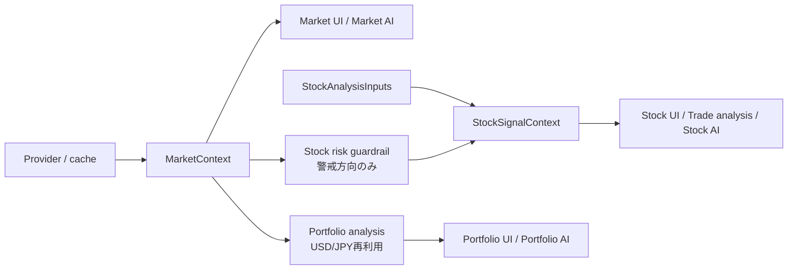

# 分析・予測機能カタログ

更新日: 2026-07-14

本書は分析系・予測系機能の正本です。各機能が答える問い、共有する入力、他機能へ影響してよい範囲を固定し、似た指標を単一スコアへ混ぜないために使用します。

## 全体の責務境界

- `MarketContext` は市場分析の正本です。UI、AI、Stockガードレール、Portfolio為替は同じスナップショットを読みます。
- `StockAnalysisInputs` は同一銘柄分析内の企業情報、価格、ベンチマーク、ニュースを一度だけ取得します。
- `StockSignalContext` は個別株の表示、オンデマンド・トレード分析、AI入力の正本です。
- Portfolioは保存済み株数・取得単価を変更せず、現地通貨時価と円換算集約を分離します。

## Market

| 機能 | 答える問い | 主入力 | 主出力 | 位置づけ・許可される連携 | 欠損時 | 更新契機 |
|---|---|---|---|---|---|---|
| 市場サマリー | 主要指数・金利・商品・為替は今どう動いたか | 市場価格provider | `market_data` | 他分析の観測値。予測ではない | 項目を省略し`partial` | 初期表示・サマリー更新 |
| IBD式市場状態 | 価格・出来高から市場状態をどう分類するか | SPY/NDX OHLCV | `ibd_regime` | 公式IBDではないproxy。戦略の状態入力 | 判定不能 | Theme/Flow |
| 市場環境評価 | トレンド、モメンタム、breadth等は総合して強いか | OHLCV、breadth、取得済みoption、市場構造 | `evaluation` | 市場の現状評価。短期予測確率を上書きしない | `データなし` | Theme/Flow、Options |
| 市場マイクロストラクチャー | CTA proxy、流動性proxy、VRP、巻き戻しリスクはどうか | SPY OHLCV、明示的に渡されたoption | `microstructure` | Theme/Flowではoptionを暗黙取得しない。Options取得後だけ同じチェーンを反映 | option要素だけ欠損 | Theme/Flow、Options |
| ETFリーダーシップ | 市場全体のリスクオン/オフ圧力はどうか | ETF価格・出来高 | `flow_monitor` | 市場全体の確認proxy | `partial` | Theme/Flow |
| セクター・テーマ資金流入 | 具体的にどの候補群が相対優位か | 代表ETF・構成銘柄 | `sector_flow` | 候補抽出proxy。ETFリーダーシップと役割を分離 | 取得率不足を警告 | Theme/Flow |
| テーマランキング | 指定期間で相対的に強い調査候補群はどれか | US/JPテーマ構成銘柄の終値 | `FetchResult[list[RankedTheme]]` | 対象市場・期間ごとの観測順位。売買指示ではない | provider失敗、空結果、取得率不足を区別し、旧リクエスト結果は破棄 | 市場/期間変更・再試行 |
| 統合トレンド順位 | 複数期間・flow・optionから何を優先調査するか | sector flow、歪み、明示option | `trend_ranking` | テーマ候補順位。売買指示ではない | itemsなし | Theme/Flow、Credit、Options |
| 信用ストレス | 株安が信用市場へ波及しているか | FRED等の信用系列 | `credit_stress` | Vol/Sentimentより先に計算し予測・戦略へ渡す | stale/cacheまたはunavailable | Credit/Risk |
| 市場歪み | ファンダメンタルとflowに乖離があるか | 企業・テーマ・flow | `market_distortions` | 調査候補を作るmodel output | 候補なし | Credit/Risk |
| ボラティリティ・レジーム | ボラの水準・期間構造・変化はどの状態か | Cboe、価格、信用ストレス | `volatility_regime` | リスク姿勢の入力 | `unavailable` | Vol/Sentiment |
| VIX×SQ週 | SQ週とVIXテクニカルが警戒条件を満たすか | VIX履歴、SQ日程 | `vix_sq_alert` | 研究用警戒材料 | `insufficient_data` | Vol/Sentiment |
| 短期市場予測 | SPY/QQQは1・5・20営業日後に上昇する確率があるか | 時点整合特徴、walk-forward | `short_horizon_forecast` | 地平ごとに`validated`の結果だけ1W/1M定性判断へ利用 | `research_only`は表示限定 | Vol/Sentiment |
| 複合センチメント | tail、vol-of-vol、PCR、Gamma、breadthの共同状態は何か | Cboe、OCC、ETF、完全Gamma | `composite_sentiment` | 確率を変えず、risk floorとStock downgradeだけ許可 | `partial`は非拘束 | Vol/Sentiment、Options |
| Option current/1W/1M | オプション市場は何を織り込むか | MarketData.app / yfinance / cache | `OptionContext` | 想定変動幅・需給。価格予測と区別 | unavailable/staleを明示 | 明示Options更新 |
| 重要水準・市場ドライバー | 支持抵抗と金利・原油・金・ドル・VIXはどうか | OHLCV、Cboe | `important_levels`, `market_driver_monitor` | 同一更新内で再利用し重複取得しない | 個別行をinsufficient | 最初の詳細段階、以後再利用 |
| 時間軸別見通し | 現在・1週・1か月の定性方向は何か | 上記の検証済み入力 | `market_timeframes` | `status`と`coverage`を併記。入力ゼロをレンジとしない | `判定不能` | 各依存段階後 |
| 戦略レジーム | どの調査姿勢が市場状態に合うか | 時間軸、重要水準、option、複合状態 | `strategy_regime` | 5種の調査姿勢とrisk budget。複合状態は上限を厳しくするだけ | 空dict | 各依存段階後 |

詳細更新の依存順は `Theme/Flow → Credit/Risk → Vol/Sentiment → Options` です。OCCはOptions再計算で既存履歴を保持し、暗黙に空へ戻しません。

## Stock

| 機能 | 答える問い | 主入力 | 出力・役割 | 欠損時 |
|---|---|---|---|---|
| テクニカル総合 | 現在のトレンド・モメンタム・支持抵抗はどうか | 1年OHLCV | `technical_data`、各機能の基礎入力 | 算出不能項目を欠損 |
| Entry Framework | 押し目・ブレイク・無効化条件は何か | technical、価格、benchmark | `trade_setup` | `wait`/警告 |
| 確率シグナル | 類似局面の5日期待値・上昇率・20日超過はどうか | 5年特徴量、benchmark | `probabilistic_signal` | 類似0件は`None`。1–29件はLow/配分0 |
| リスク調整・配分 | エッジを考慮した観察上限はどこか | 期待値、vol、regime、tail | `exposure_sizing` | 必須入力欠損はWatch/0% |
| Trend Follow | 順張り条件の過去検証はどうか | 5年OHLCV | 独立診断。確率シグナルを置換しない | partial |
| FOMOレジーム | 過熱・急変リスクはどうか | 1年OHLCV | Entryと根拠一致度の上限制約 | unavailable |
| 適応型ファンダメンタル | 業種・規模に合う財務評価は何か | 企業指標 | `fundamental_profile` | 必須KPI不足は部分評価 |
| セクター・テーマ | 所属群と市場順位はどうか | 企業情報、相対価格、Market cache | `sector_theme_context` | cache優先、必要時だけlive fallback |
| 根拠一致度 | 技術・Entry・財務・テーマが整合するか | 4つの必須入力 | `purchase_evidence` | 1つでも欠損なら算出不可 |
| 日本株需給期日 | 信用期日・制度信用・貸借警戒はどうか | 日本株OHLCV、任意の制度信用入力 | `japan_supply_demand` | 日本株以外not applicable、入力不足明示 |
| 市場ガードレール | 市場tail riskが個別株姿勢を悪化させるか | cached `MarketContext` | downgrade-only。upgrade禁止 | monitoring/unavailable |
| トレード分析・AI | 表示済み分析をどう条件整理するか | `StockSignalContext` | 再取得・再採点せず同じ根拠を説明 | context不足を明示 |

確率、Trend Follow、FOMO、Entryは異なる問いに答える独立診断です。主要4診断は最大4並列、各8秒・グループ16秒を上限とし、個別失敗を他結果へ波及させません。

## Portfolio

| 機能 | 契約 |
|---|---|
| 現地通貨評価 | `value` / `native_value` は銘柄通貨の時価。取得単価も保存形式を変えず現地通貨として扱う |
| 円換算 | `MarketContext`のUSD/JPYを優先し、なければ`JPY=X`を一度だけ取得する |
| 集約 | 全銘柄を換算できる場合だけ`total_value_jpy`、`weight_pct`を計算する |
| 為替欠損 | 通貨別小計を残し、円換算総額・構成比を`None`にする。0やドル総額を作らない |
| セクター・テーマ | 円換算後の同一基準で集計。US `THEMES` と日本株 `JP_THEMES` を使い分ける |
| 集中度 | top1、top3、HHIを一度だけ計算しUIとAIが共有する |
| AI | 現在の`MarketContext`、保存cache、既存live fallbackの順。市場欠損を中立値へ置換しない |

## 変更時の不変条件

1. 欠損値を0、中立、固定PCR、固定金利へ置換しない。
2. UIとAIは同じ共有コンテキストを読む。AIだけの再取得・再採点を追加しない。
3. `validated`でない予測は戦略へ拘束的に使わない。
4. 複合センチメントと市場ガードレールは警戒を維持・強化するだけで、個別株を格上げしない。
5. 明示Options更新以外からMarketData.app option chainを暗黙取得しない。
6. 既存ルート、公開facade、保存スキーマ、互換キーは維持する。
