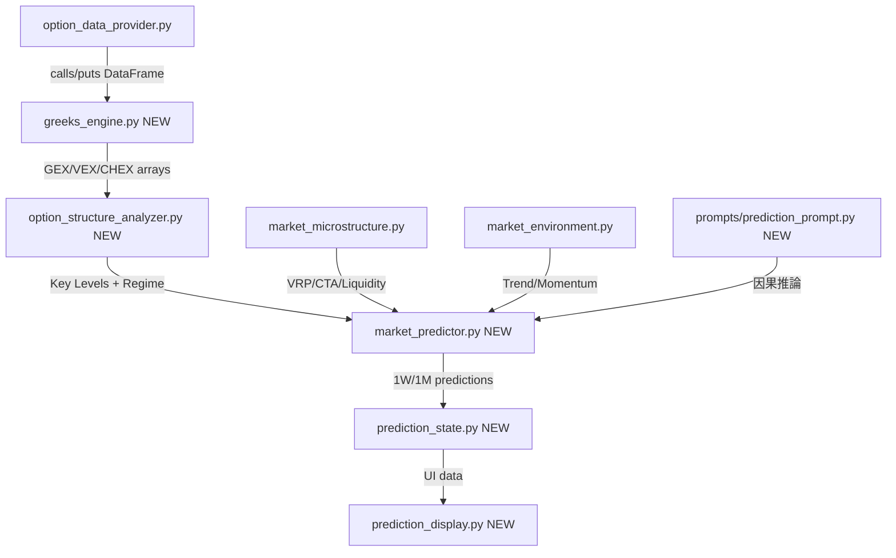

# ③ 市場予測機能 - 専用実装計画書

## 概要

Gemini作成の「オプション構造解析に基づく市場予測仕様書」を、既存コードベースに段階的に統合する実装計画。
仕様書の理想（QuantLib、Polygon.io、マルチエージェント等）と現実（yfinance無料データ、個人向けアプリ）の間で、**最大の予測価値を最小の複雑性で実現する**プラグマティックな設計。

---

## 既存実装との差分分析

| 仕様書の要件 | 既存実装 | ギャップ |
|:---|:---|:---|
| GEX計算 | ✅ `option_analyst.py` に実装済み | 簡易版（$\Gamma \times OI \times 100 \times S$）。$S^2 \times 0.01$ 版への切り替え要 |
| VEX (Vanna) | ❌ 未実装 | 新規追加。yfinanceはvannaを返さない→BSM近似で自前計算 |
| CHEX (Charm) | ❌ 未実装 | 新規追加。同上 |
| Call/Put Wall | ✅ 実装済み | OK（`calculate_gex`内で算出） |
| Gamma Flip | ❌ 未実装 | 新規追加。GEXプロファイルのゼロ交差点を探索 |
| Vol Trigger | ❌ 未実装 | 新規追加。ヒストリカルデータから統計的に識別 |
| Max Pain | ✅ 実装済み | OK |
| 市場レジーム判定 | △ 部分的 | `market_environment.py`にMA/FTD/Vol判定あり。GEX符号によるレジーム分類を追加 |
| VRP (Vol Risk Premium) | ✅ `market_microstructure.py` | OK |
| CTA推定 | ✅ `market_microstructure.py` | OK |
| 1週間予測 | ❌ 未実装 | 新規。Charm減衰＋ピンニング予測 |
| 1ヶ月予測 | ❌ 未実装 | 新規。OpExサイクル＋Vannaフロー |
| QuantLib | ❌ 未使用 | `py_vollib_vectorized` を採用（QuantLibはC++ビルド依存が重い） |
| Polygon.io / Tradier | ❌ 未統合 | Phase 2で検討。Phase 1はyfinanceデータで実装 |
| マルチエージェント | ❌ 未実装 | 因果推論プロンプトをGeminiに統合（CrewAI不要） |

---

## アーキテクチャ方針

> [!IMPORTANT]
> **QuantLib vs py_vollib**: 仕様書はQuantLibを強く推奨しているが、Windows環境でのC++ビルド依存・インストールの複雑性を考慮し、`py_vollib_vectorized`（numpy vectorized BSM）を Phase 1 で採用する。0DTE精度が問題になった場合に Phase 2 で QuantLib へ移行する。

---

## 実装フェーズ

### Phase 1: Greeks計算エンジン＋構造解析（コア）

#### [NEW] `src/greeks_engine.py`
BSMモデルによるGreeks（Vanna, Charm, Speed）のベクトル化計算エンジン。

- `calculate_bsm_greeks(S, K, T, r, sigma, option_type) -> dict`
  - delta, gamma, vanna, charm, speed を一括返却
  - numpy vectorized（ループ排除）
  - 0DTE対策: T < 0.001 のガード処理
- `enrich_option_chain(calls_df, puts_df, spot, risk_free_rate) -> tuple[DataFrame, DataFrame]`
  - yfinanceのDataFrameにvanna, charm列を追加
- 依存: `numpy`, `scipy.stats.norm`（追加ライブラリ不要）

#### [NEW] `src/option_structure_analyzer.py`
マクロ・エクスポージャーの算出＋キーレベル特定。

- `calculate_net_gex(calls, puts, spot) -> float` - 市場全体のネットGEX
- `calculate_vex(calls, puts, spot) -> float` - ネットVEX
- `calculate_chex(calls, puts, spot) -> float` - ネットCHEX
- `find_gamma_flip(calls, puts, spot) -> float | None` - ゼロガンマレベル
  - スポット±10%のGEXプロファイルを生成し、符号反転点を二分探索
- `find_vol_trigger(calls, puts, spot, hist_data) -> float | None`
  - ガンマフリップの下方で、実現ボラティリティが統計的に拡大するレベル
- `classify_regime(net_gex, spot, gamma_flip) -> str`
  - "positive_gamma" / "negative_gamma" / "transition"
- `generate_gex_profile(calls, puts, spot, range_pct=0.10) -> list[dict]`
  - GEXカーブデータ（UI描画用）

#### [MODIFY] `src/option_analyst.py`
- `analyze_option_sentiment()` にVEX, CHEX, レジーム情報を追加
- `_fetch_option_data()` で取得したデータを `greeks_engine.enrich_option_chain()` で強化

---

### Phase 2: 予測モデル

#### [NEW] `src/market_predictor.py`
1週間・1ヶ月の予測ロジック。

**1週間予測 (`predict_1w`)**:
- Charm減衰によるピンニングターゲット算出
- 0DTE建玉集中ストライクの特定
- Volume-to-OI比率によるフロー判定
- 出力: `{"pin_target", "support", "resistance", "bias", "confidence", "rationale"}`

**1ヶ月予測 (`predict_1m`)**:
- OpExサイクル判定（次回Monthly OpEx日の算出）
- OpEx前後の「弱さの窓」フラグ
- Vannaサイクル: プット側VEX総量からの買い戻し圧力推定
- GEXレジーム遷移予測
- 出力: `{"trend", "opex_risk", "vanna_support", "key_levels", "rationale"}`

**戦略判定ルール (`generate_strategy_recommendation`)**:
- 仕様書§6.2のIF-THENルールをコード化
  - ポジティブ体制下の押し目買い
  - ネガティブ体制下のブレイクアウト警戒
  - レジーム遷移時の警告

#### [NEW] `src/prompts/prediction_prompt.py`
因果推論フレームワークに基づくGeminiプロンプト。

- **WHO→WHOM→WHAT** フレームワーク強制
- ディーラーのデルタニュートラル維持行動を推論の起点に指定
- 1W: Charm主導のピンニング引力を中核根拠
- 1M: OpEx後のVannaサイクルを中核根拠
- 「流動性の幻想」（ネガティブGEX下の出来高急増）の正しい識別を指示

---

### Phase 3: UI統合

#### [NEW] `frontend/state/prediction_state.py`
- `PredictionState(rx.State)` - 予測データの状態管理
- `prediction_1w`, `prediction_1m`, `regime_info`, `key_levels`
- `gex_profile_data` (GEXカーブ描画用)
- `fetch_predictions()` - 非同期データ取得

#### [NEW] `frontend/components/prediction_display.py`
- レジーム表示（ポジティブ/ネガティブ・ガンマ、色分け）
- キーレベル表示（Gamma Flip, Vol Trigger, Call/Put Wall）
- 1W/1M予測カード
- GEXプロファイルカーブ（Recharts）
- AI因果推論レポート表示

#### [MODIFY] `frontend/pages/index.py`
- オプション分析セクションの下に「📈 市場予測」セクションを追加

#### [MODIFY] `frontend/state/market_state.py`
- 既存のOptionSummaryにVEX, CHEX, regime情報を追加

---

### Phase 4: 型付きデータ連携

- 市場予測は独立した型付きContextとしてReflex UIへ渡す。
- 自動生成レポートには接続せず、構造化された根拠・欠損状態・取得時刻を画面に直接表示する。
- AIを利用する場合も、明示操作された既存の個別株分析から参照するだけとし、市場画面の表示時には実行しない。

---

## Open Questions

> [!IMPORTANT]
> 1. **データソース**: Phase 1はyfinance（無料）で実装しますが、Polygon.ioやTradierの有料APIキーをお持ちですか？精度向上のために Phase 2 で統合可能です。
> 2. **QuantLib**: Windows環境でのビルドが重いため `scipy` ベースのBSM実装を提案していますが、QuantLibへのこだわりはありますか？
> 3. **マルチエージェント**: 仕様書ではCrewAI/Difyを提案していますが、現行のGemini単体＋構造化プロンプトで十分な品質が出せると判断しています。CrewAI導入の意向はありますか？
> 4. **予測UI配置**: Market Intelligence画面の既存オプション分析を拡張する形で配置しますが、別ページ（例: `/prediction`）にする方が良いですか？

## 実装順序と依存関係

| 順序 | フェーズ | 依存 | 推定工数 |
|------|---------|------|----------|
| 1 | Phase 1: Greeks Engine + 構造解析 | ①のオプションデータ修正完了後 | 大 |
| 2 | Phase 2: 予測モデル | Phase 1 | 大 |
| 3 | Phase 3: UI統合 | Phase 2 | 中 |
| 4 | Phase 4: 型付きデータ連携 | Phase 2 | 小 |

## 検証計画

### ユニットテスト
- `test_greeks_engine.py` - BSM計算の精度検証（既知のBlack-Scholes解との比較）
- `test_option_structure.py` - GEXプロファイル、ガンマフリップの正当性検証
- `test_market_predictor.py` - 予測ロジックのエッジケーステスト

### 統合テスト
- SPY/QQQ/IWMのオプションチェーンで全パイプラインを実行
- 計算結果をSpotGamma等の公開データと照合

### UI検証
- `reflex run` で予測セクションの表示確認
- GEXプロファイルカーブの描画確認
